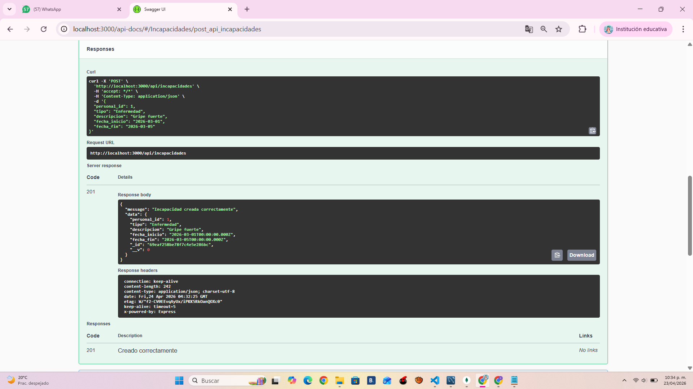
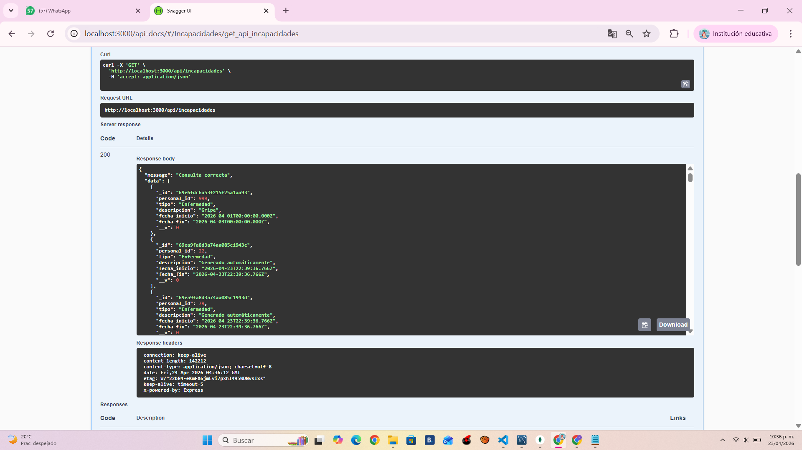
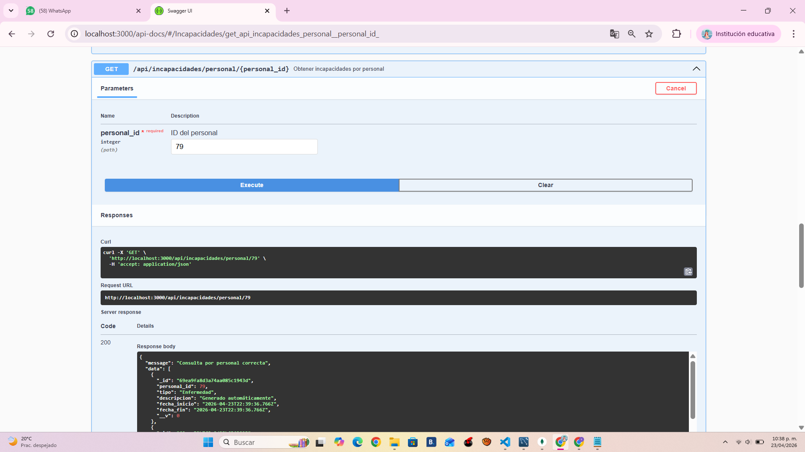
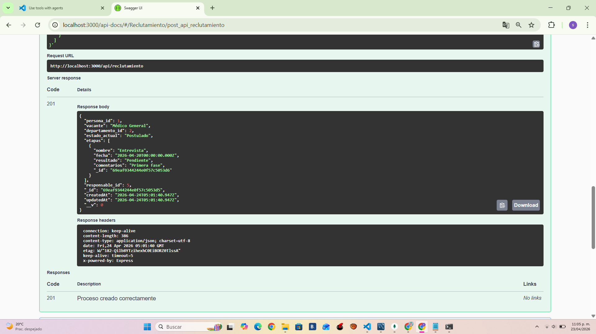
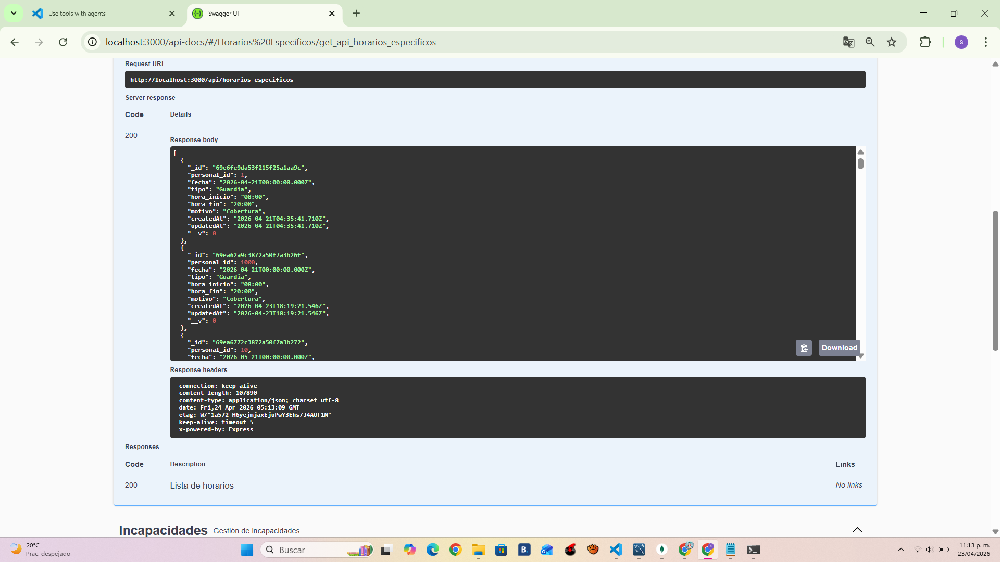
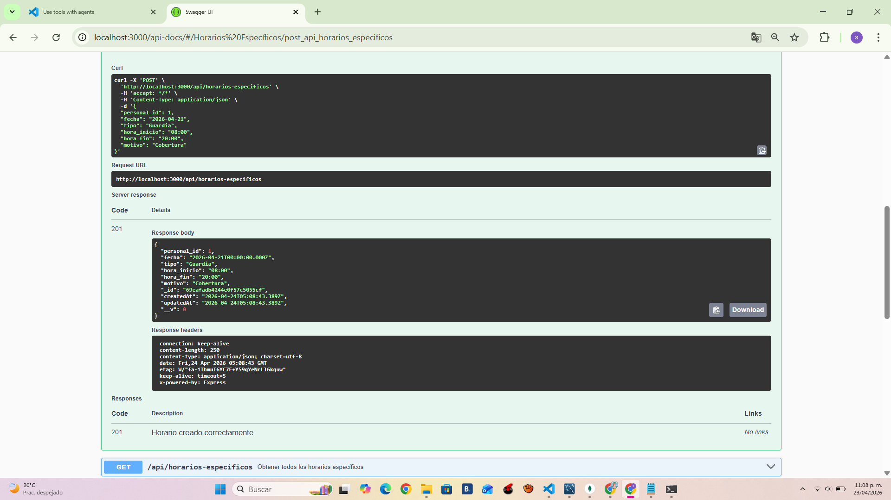
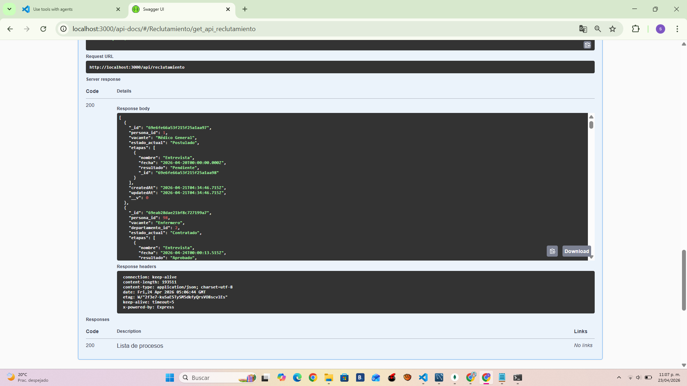
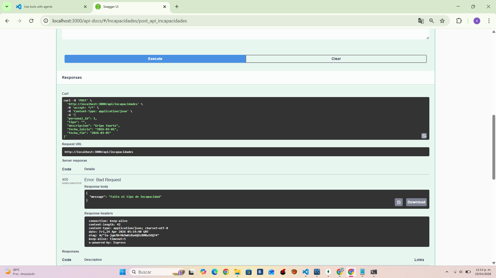
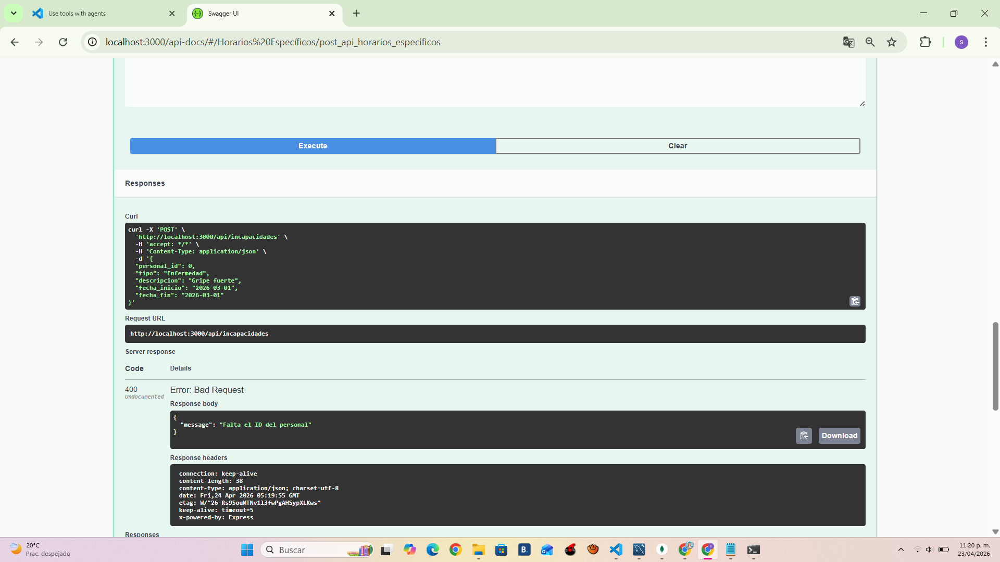

# 🧪 Reporte de Pruebas API

## 📌 Información General
**Proyecto:** Hospital_hr  
**Fecha:** 2026-04  
**Base de datos:** MongoDB + MySQL  
**Responsable:** Recursos Humanos  

---

## ✅ TEST-001: Crear incapacidad
**Descripción:** Registro de una incapacidad en MongoDB  
**Objetivo:** Validar que se pueda guardar correctamente  

**Endpoint:**  
POST /api/incapacidades

**Datos de entrada:**
{
  "personal_id": 1,
  "tipo": "Enfermedad",
  "descripcion": "Gripe",
  "fecha_inicio": "2026-04-01",
  "fecha_fin": "2026-04-03"
}

**Criterios de aprobación:**
- Status 200
- Documento guardado en MongoDB

**Resultado:** ✔️ Éxito  
**Evidencia:**  
 

---

## ✅ TEST-002: Obtener incapacidades
**Descripción:** Consulta de todas las incapacidades  
**Objetivo:** Verificar obtención de registros  

**Endpoint:**  
GET /api/incapacidades

**Criterios de aprobación:**
- Status 200
- Lista de incapacidades

**Resultado:** ✔️ Éxito  
**Evidencia:**  
  

---

## ✅ TEST-003: Obtener incapacidades por personal
**Descripción:** Consulta filtrada por personal_id  
**Objetivo:** Validar integración híbrida  

**Endpoint:**  
GET /api/incapacidades/personal/1

**Criterios de aprobación:**
- Datos de MySQL + MongoDB
- Estructura correcta

**Resultado:** ✔️ Éxito  
**Evidencia:**  
  

---

## ✅ TEST-004: Crear reclutamiento
**Descripción:** Registro de proceso de reclutamiento  
**Objetivo:** Validar inserción  

**Endpoint:**  
POST /api/reclutamiento

**Datos:**
{
  "persona_id": 1,
  "vacante": "Médico General",
  "estado_actual": "Postulado"
}

**Criterios de aprobación:**
- Status 200
- Registro creado

**Resultado:** ✔️ Éxito  
**Evidencia:**  
   

---

## ✅ TEST-005: Obtener reclutamientos
**Descripción:** Consulta de procesos  
**Objetivo:** Validar lectura  

**Endpoint:**  
GET /api/reclutamiento

**Criterios de aprobación:**
- Status 200
- Lista de documentos

**Resultado:** ✔️ Éxito  
**Evidencia:**  
 
---

## ✅ TEST-006: Crear horario específico
**Descripción:** Registro de horario médico  
**Objetivo:** Validar inserción  

**Endpoint:**  
POST /api/horarios-especificos

**Datos:**
{
  "personal_id": 1,
  "fecha": "2026-04-21",
  "tipo": "Guardia",
  "hora_inicio": "08:00",
  "hora_fin": "20:00"
}

**Criterios de aprobación:**
- Status 200
- Registro creado

**Resultado:** ✔️ Éxito  
**Evidencia:**  
  

---

## ✅ TEST-007: Obtener horarios específicos
**Descripción:** Consulta de horarios médicos  
**Objetivo:** Validar lectura  

**Endpoint:**  
GET /api/horarios-especificos

**Criterios de aprobación:**
- Status 200
- Lista de horarios

**Resultado:** ✔️ Éxito  
**Evidencia:**  
 

---

## ⚠️ TEST-008: Error por datos incompletos
**Descripción:** Intento de crear incapacidad sin campos requeridos  
**Objetivo:** Validar validaciones del sistema  

**Endpoint:**  
POST /api/incapacidades

**Datos:**
{
  "tipo": "Enfermedad"
}

**Criterios de aprobación:**
- Status 400 o 500
- Mensaje de error

**Resultado:** ✔️ Error controlado  
**Evidencia:**  

---

## ⚠️ TEST-009: Personal inexistente
**Descripción:** Crear incapacidad con personal_id inválido  
**Objetivo:** Validar integridad híbrida  

**Datos:**
{
  "personal_id": 999,
  "tipo": "Accidente",
  "fecha_inicio": "2026-04-01",
  "fecha_fin": "2026-04-02"
}

**Criterios de aprobación:**
- Mensaje: "Personal no existe"

**Resultado:** ✔️ Validación correcta  
**Evidencia:**  

---

## 🚀 TEST-010: Prueba de carga
**Descripción:** Envío masivo de solicitudes  
**Objetivo:** Evaluar rendimiento de la API  

**Herramienta:** loadTest.js

**Criterios de aprobación:**
- La API responde sin caerse
- Maneja múltiples solicitudes

**Resultado:** ✔️ Estable bajo carga  

**Evidencia:**
- Consola con múltiples requests  
- Tiempo total medido  

---
# Dashboard final para evaluacion
**Dashboar 1:**

**Dashboar 2:**

**Dashboar 3:**

---

# 📎 Notas Finales
- Todas las pruebas fueron ejecutadas correctamente.
- No se detectaron fallos críticos.
- Sistema estable en condiciones normales y de carga.

---
